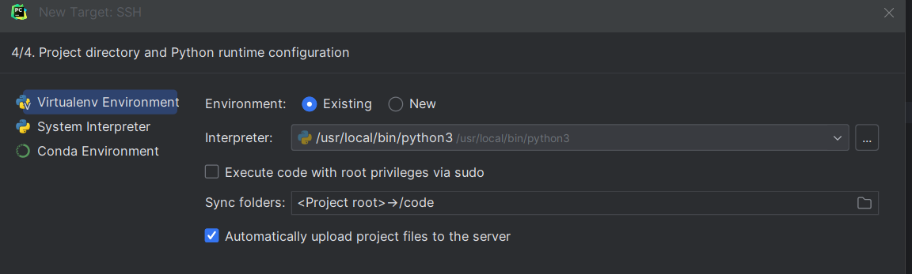

# 1.Docker设置
## 1.1 开放docker 22端口
    pycharm连接容器使用ssh,需要提前开放22映射端口
```shell
docker run \
	--name=pytorch_cuda \指定
	--runtime=nvidia \ # 指定运行时使用的nvidia显卡
	-p 12345:8888 \  # jupyter notebook的8888端口映射到宿主机的12345端口
	-p 54321:22   \  # ssh的22端口映射到54321端口
	-v /home/docker_share:/home/  \ # 将docker中的/home/目录映射到/home/docker_share
	pytorch_cuda:latest
```

## 1.2 确认docker容器是否支持ssh服务
```shell
apt update
apt-install openssh-server
```
修改sshd_config
```shell
vim /etc/ssh/sshd_config
# PermitRootLogin的值从prohibit-password改为yes 
# X11UseLocalhost设置为no
```
在容器内重启ssh服务
```shell
systemctl restart ssh
```
重启后以本文为例可尝试连接
```shell
ssh -p 54321 root@localhost
```

# Pycharm配置（以2023.3为例）
1. 打开python项目，配置环境时选择新增环境，模式为ON SSH

2. 输入连接docker的ssh的ip、端口、用户

3. 输入docker内部用户密码

4. 选择已存在环境并在interpreter中选择容器内python，在sync folder中配置本地路径与容器内路劲映射关系。保证相对路径下的命令，远程本地都可使用


 # 3.注意点
1. 配置完成后会将本地文件自动上传可手动关闭任务
2. 配置完成后效果如下

3. 实际逻辑为将本地命令在远程执行并将数据同步，例如:web程序在本地执行，日志输出控制台，但实际访问链接在容器所在服务器，并需要映射端口，而非在本机localhost